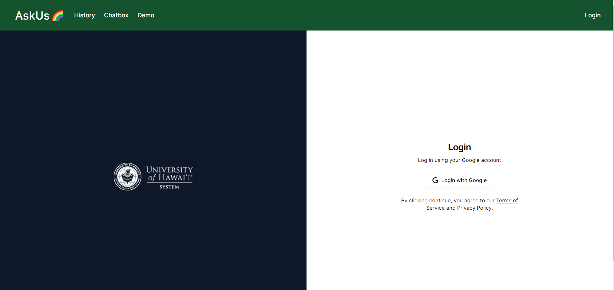

# its-knowledge-base 

## Table of Contents
- [Overview](#overview)
- [Features](#features)
- [User Guide](#user-guide)
- [Developer Guide](#developer-guide)
- [Pages and Features](#pages-and-features)
- [Team Members](#team-members)
- [Deployment](#deployment)
- [Community Feedback](#community-feedback)

## Overview
The current UH ITS Ask Us system is a keyword search-based system that requires users to search for keywords in order to find the information they need. This system is not very user-friendly and requires users to know what they are looking for in order to find the information they need. Our goal is to create a conversational AI to help support the functions of the UH ITS Ask Us team. This AI will be trained on the knowledge base provided to us by the ITS team which consists of hundreds of public web pages containing valuable information to assist in alleviating the workload, enhancing the user experience, and improving the efficiency of the current help process. We will also be designing a reactive, intuitive, and functional user interface to ensure operations continue as smoothly as possible.

We used a locally hosted LLAMA2 7b model, ensuring confidentiality. Using the already available computational resources located at UH Manoa, the model can be easily hosted in house without relying on third-party.

## Features

- **Natural Language Understanding**: Our AI chatbot can understand and respond to your queries in natural language.
- **24/7 Availability**: You can access our chatbot's assistance anytime, day or night.
- **Knowledge Base**: It has access to a vast knowledge base to provide you with accurate information.
- **Customization**: You can personalize your chatbot's responses to suit your preferences.

## User Guide

New users can start utilizing our program by following these steps:

1. Go to the **login page** by clicking on the 'Login' button in the top right corner. Here, users can create an account by signing in with Google. Signing in with Google will allow us to autofill your email, name, and portray your Google account photo when using the chatbot. 

Alternatively, 
Users can clik on the **Chatbox** button in the Navigation Bar. Users will be asked for their email, first name, and their question they would like to ask the chatbot. The page looks as follows:

2. Next, users can start a conversation with our chatbot by clicking the "Chat With Us" button on the bottom right of the screen OR by going to the "Chatbox" tab in the Navigation bar, at the top of the website.

The chatbot will promptly greet the user and how it can help them. Users can then type their question in the chat box and press submit. The chatbot will then respond to the user's queries and provide them with the information they need. If the chatbot is unable to find an accurate response to the user's question, it will tell the user that it does not answer the question. This prevents our chatbot from creating inaccurate responses. 

Users may also **rate** the chatbot's responses by clicking on the thumbs up or thumbs down button, located under the chatbot's response. This will help us gain feedback from our users and improve our chatbot's responses in the future.

3. If users want to check their message history with the ChatBot from different sessions, they can click on the "History" tab in the Navigation bar, at the top of the website. This will take them to the "User Session Messages History" page.

This page records past conversations with the chatbot. This way, if users forget how to do something, they can refer back to their chat history to find the information they need.

# Pages and Features
## Login Page 
New users and exisiting users can sign in using Google to create an account. User and Admin role have different permissions to access different pages.

Contact us if you wish your account to be designated as an administrator. You will be able to see all user's histories and analytics.

## Landing Page
The landing page will display the home screen of the ITS ASKUS webpage with a chat overlay to promptly aid users

## Admin Dashboard (Analytics) Page
Admins can view the analytics of the chatbot's performance. This includes the frequency of message ratings, the time spent in sessions, and recently asked questions.

## Admin Master Chat History Page
Admins can view the chat history/sessions of **all users** with the chatbot.

## User View Sessions Page
Users can only view **their own chat history** with the chatbot from previous sessions. 

## View Messages Page
Users can review their chat history with the chatbot from a specific session.

## Full screen chat window
The chat window can be expanded/popped out into a different tab to enhance the immersive experience

## Demo Page
The demo page portrays the chatbot's capabilities and how it can offer help to users while being integrated with the current ITS website.

## How to Use

1. Start a conversation with the chatbot by clicking the "Chat Now" button.
2. Type your questions or requests, and the chatbot will provide responses.
3. You can ask for help, information, or assistance with various tasks.

## Examples

- "I forgot my password"
- "How can I type Hawaiian Diacratics"
- "I can't log into Laulima"

## Community Feedback

We gathered input from our community to seek suggestions for enhancing our chatbot! Fortunately, we've received a lot of positive feedback. Some key areas for improvement include enhancing website navigation, increasing interactive elements, and refining the chatbot's responses. 

Some of the feedback we received includes:

*"It was kind of hard to tell what page I was on. It would be nice if I could tell exactly what page I was on if I were to screenshot it--like page breadcrumbs."*

*"Everything looks great, but I don't like how I  have to keep pressing the back arrow to go back from the Demo page to the Home page. It would be better if I could just click on a button."*

After receiving feedback from our community, we kept these suggestions in mind when updating our chatbot. We hope the updated chatbot meets our user's expected performance and experience. We will continue to gather feedback from our community to improve our chatbot's performance and user experience.

## Postgres
All responses and users are stored in a postgres database.

### Entity Relationship Diagram

Schemas for Account, VerficiationToken, and Session are dictated by the Google OAuth2 integration.

## Team Members
- Salina T. - developer
- Ethan C. - developer
- Vincent C. - develoepr

## Source Code & Demo
- Demo: [https://its.monkes.net/](https://its.monkes.net/) Down
- Github: [https://github.com/bruhgroup/its-knowledge-base](https://github.com/bruhgroup/its-knowledge-base)

## Developer Guide
*This code is not currently being maintained, and thus the demo is not guaranteed to work.*

We used free Google Cloud Platform credits to run a VPS with a single Nvidia T4 GPU to serve and run the local LLM and website.

For testing purposes, any PC with a GPU that has >6GB VRAM should be enough. While developing we were using an single RTX 2080 which worked pretty well.

## Packages
- `qa-chatbot`: Python backend LLAMA2 Model using Langchain 
- `html-extractor`: extracts question/answer text from html files into a single json file.
- `web-app`: lists available questions/answers, with an embeddable chatbot.
